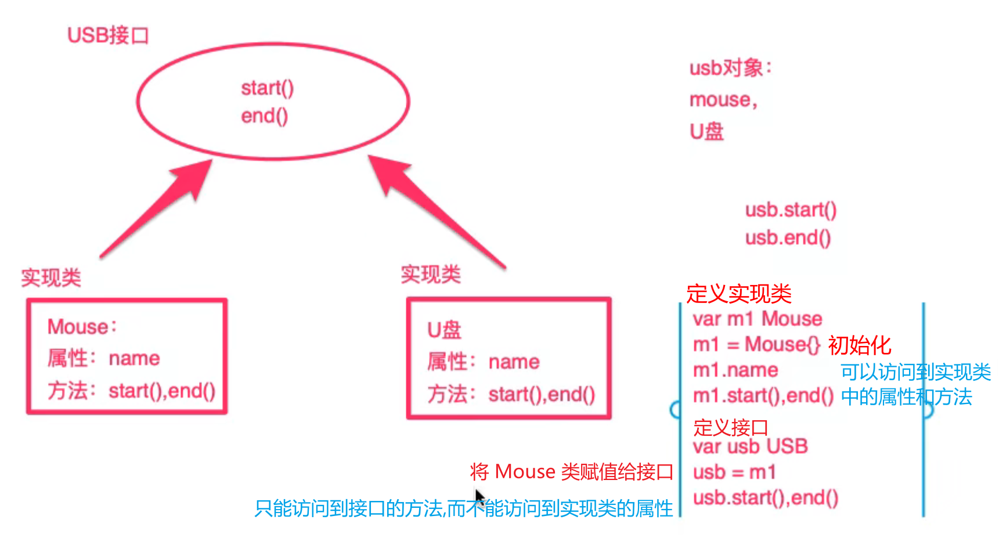
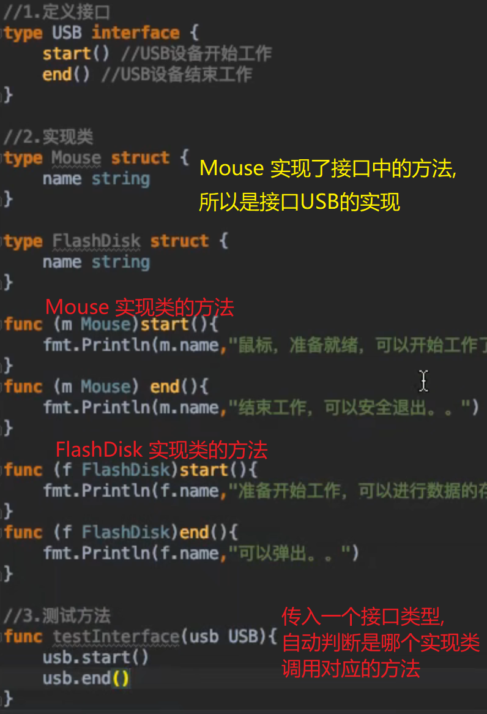
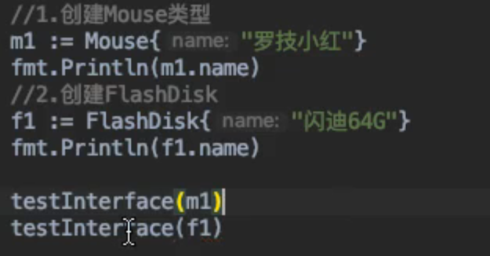
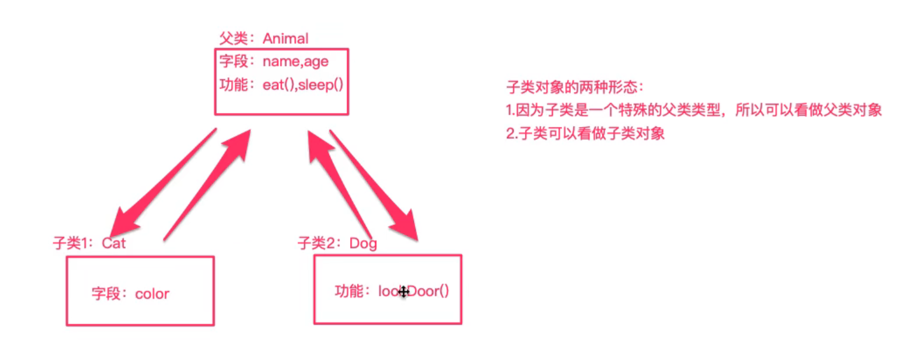

# Go 接口
**面向对象** 世界中的接口的一般定义是"**接口定义对象的行为**"。它表示让指定对象应该做什么。实现这种行为的方法（实现细节）是**针对对象**的。  
在 `Go` 中，接口是**一组方法签名**。当类型为接口中的所有方法提供定义时，它被称为**实现接口**。它与OOP非常相似。接口指定了类型**应该具有**的方法，类型决定了**如何实现**这些方法。

> 它把所有的具有共性的方法定义在一起，任何其他类型只要实现了这些方法就是实现了这个接口  
> 接口定义了一组方法，如果某个对象实现了某个接口的所有方法，则此对象就实现了该接口。

## 图示
  

## 示例
  
  
  
> Go语言中接口和类型的实现方式是**非侵入式**的,接口定义的方法没有具体代码.

## 通过接口模拟多态

### 多态的定义
"一个事物的多种形态"  
  

就一个接口的实现:  
1. 看成**实现本身的类型**，能够访问**实现类中的属性和方法**.  
2. 看成是**对应的接口类型**，那就**只能够访问接口中的方法**.  

接口的用法：  
1. 一个函数如果接受**接口类型作为参数**，那么实际上**可以传入该接口的任意实现类**对象作为参数。  
2. 定义一个类型为**接口类型**，实际上可以**赋值为任意实现类的对象**.   

鸭子类型:  
> 待补充...